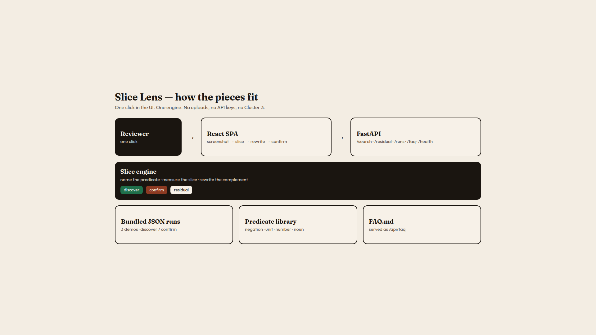
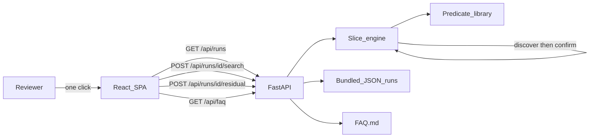

# Slice Lens: the problem, and how we solve it

This is the plain-language companion to [`DESIGN.md`](DESIGN.md). If you only have a few minutes, read this. Then open the live app and press one button:

**https://slice-lens-production.up.railway.app**

A narrated walkthrough of this document, plus a live demo, is in the pull request video. Play it with sound on — the explanation is spoken, not just shown.

---

## The problem, in one sentence

A single accuracy number looks like a finding. It is usually just a screenshot.

## Why that number lies

Imagine a model that answers short yes/no facts. A launch post says:

> **Accuracy: 87.8%**

That number is true as arithmetic. It is false as a story. The errors are not sprinkled evenly across the eval. They pile up on one kind of prompt — the ones that contain a **negation** (“not”, “never”, “n’t”, “without”). On those items the model is at **14%**. On everything else it is at **96.0%**.

The 87.8% is a blend. It hides a systematic failure behind a number you would happily paste into a slide.

This is the everyday eval failure mode:

1. You run a benchmark.
2. You report the average.
3. A reviewer asks “where did it fail?”
4. You shrug, or you point at an unlabeled cluster named **Cluster 3**.
5. Nobody can write a test, grep a new eval, or disagree with a sentence, because there is no sentence.

**Cluster 3 is not an actionable finding.** “The prompt contains a negation” is.

## What “solved” has to mean

Fixing this is not “cluster the errors harder.” Clustering will still give you a blob. A blob cannot go into a unit test.

A solution has to do four things, in public:

1. **Name** the failure. A boolean predicate with an English label: *has negation*.
2. **Measure** it. Accuracy on that slice, not just on the whole run.
3. **Rewrite** the headline. What would you have reported if this slice were not in the eval? That is accuracy on the complement — *you’d have reported*.
4. **Confirm** it. The same predicate on a held-out split that was not used to decide whether the slice exists. If it does not replicate, say so on screen. Do not quietly drop it.

Slice Lens is that loop, as one click.

## How Slice Lens works

There is no file picker. There is no API key. Three eval runs ship inside the image.

### Step 1 — The vanity number

You pick a bundled run (**Negation trap**, **Units dropped**, or **The average lied**) and press **Look through this run**. The first thing on screen is the green hero: overall accuracy. That is the screenshot. Slice Lens shows it on purpose, so you feel the temptation to ship it.

### Step 2 — The interpretable slice

Behind the button, a tiny library of predicates is applied to every prompt:

| Predicate | What it means in English |
| --- | --- |
| `has_negation` | The prompt contains a negation (*not, never, no, n’t, without, …*). |
| `has_unit` | The prompt includes a measurement with an explicit unit (*km, kg, °C, …*). |
| `has_number` | The prompt contains a numeral. |
| `has_uncommon_noun` | The prompt contains a rare noun (*axolotl, fjord, yttrium, …*). |

A slice is promoted only if, on the **discover** split, it is large enough to matter and accuracy drops by at least eight points versus the discover base rate. The search is deliberately small. The interesting work is not a larger hypothesis language. It is the rewrite and the confirm.

### Step 3 — The rewrite

The rust hero replaces the green one. You see the slice accuracy, then a comparison row:

**screenshot / this slice / you’d have reported**

On Negation trap that row is **87.8% / 14% / 96.0%**.

*You’d have reported* is not a promise the model is good. It is a rewrite of the headline you already wanted to ship: accuracy on every item **not** in the open slice.

### Step 4 — Confirm, in public

Every item is tagged `discover` or `confirm`. Search only looks at discover when it decides whether a predicate is interesting. Then it asks the same question on confirm.

- **confirmed** — the held-out split is still much worse. Trust the rewrite.
- **did not replicate** — discovery looked spicy; confirm did not agree. The slice stays on screen anyway. The tool is allowed to be wrong in public.

That second badge is why **The average lied** exists: `has_number` holds, `has_uncommon_noun` does not.

### Residual: “is that all?”

After the named slices are on screen, **Search the residual** excludes every item those slices already claimed and searches again. If nothing systematic remains, the empty state is a full sentence: **Nothing else is hiding.** Residual is not a second product. It answers one question.

## Architecture

The product is one page talking to one engine. Reviewers are not a data pipeline.

The same diagram as a page you can open: [`docs/architecture.html`](docs/architecture.html).

How the pieces talk:

| Piece | Where it lives | Job |
| --- | --- | --- |
| Bundled evals | `app/demos/*.json` | Three runs, already split into discover / confirm. No upload. |
| Predicate library | [`app/predicates.py`](app/predicates.py) | Four boolean functions. No embeddings. No model. |
| Slice engine | [`app/engine.py`](app/engine.py) | Promote slices, rewrite the complement, badge confirm vs fluke, residual search. |
| HTTP API | [`app/main.py`](app/main.py) | `/health`, list runs, search, residual, FAQ. Serves the built UI. |
| React UI | [`frontend/src/App.tsx`](frontend/src/App.tsx) | One interaction: screenshot → slice → rewrite → confirm. |
| Tests in the image | `tests/`, `frontend/src/App.test.tsx`, `Dockerfile` | A red suite cannot become a live Railway service. |

## The three demos, with the numbers

**Negation trap** — yes/no reading of a short fact. The model drops the negation and answers the affirmative.

- Screenshot: **87.8%**
- Slice `has_negation`: **14%**
- You’d have reported: **96.0%**
- Badge: **confirmed**

**Units dropped** — the model ignores the unit.

- Screenshot: **84.3%**
- Slice `has_unit`: **8%**

**The average lied** — two hypotheses, one of them a fluke.

- Screenshot: **77.2%**
- `has_number`: **confirmed**
- `has_uncommon_noun`: **did not replicate**

That last run is the honesty check. A tool that can only celebrate confirmed slices is a marketing site. A tool that keeps the miss on screen is an eval tool.

## Why not embeddings, k-means, or an LLM?

A reviewer cannot act on a vector neighborhood. They cannot grep it. They cannot unit-test it. They cannot disagree with it in a sentence.

An LLM that proposes hypotheses would be a different product, and it would need an API key — the opposite of a self-contained URL.

Slice Lens bets that a tiny, named, confirmable predicate is worth more than a beautiful unlabeled map.

## What this prototype is not

- Not an eval upload service.
- Not a general slice language (four predicates will not cover production).
- Not a claim that the complement accuracy is the “true” model quality.
- Not Theme 1–3 of a broader take-home. This is Theme 4: a URL that does one trick well.

## What to do in five minutes

1. Open https://slice-lens-production.up.railway.app
2. Leave **Negation trap** selected. Press the black button.
3. Watch 87.8% give way to a rust 14% and a 96.0% “you’d have reported.”
4. Read **Where did the errors go?**
5. Expand the FAQ, starting with **What should I click first?**
6. Optionally switch to **The average lied** and look at both badges.

If that path fails, the product fails. Everything else is secondary.

---

*Headline accuracy is a screenshot, not a finding. Name the slice.*
